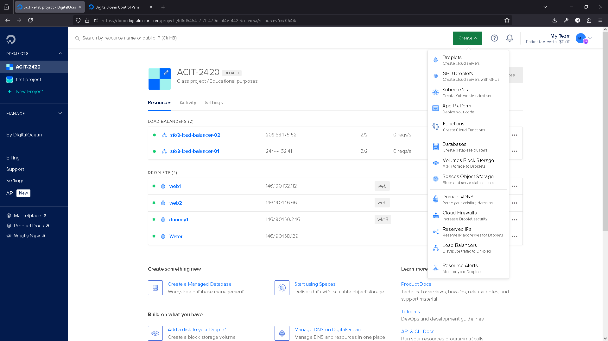

# ACIT 2420 Assignment 3 Part 2
This assignment will set up two servers with a load balancer. The servers will support HTML rendering and file downloading. 

## Tech Stack
* nginx
* DigitalOcean
* ufw
* bash
* git

## Task 1: Create Droplets
Let's start with creating two virutal machine (droplet) on DigitalOcean by click the `Create` button at the top right. Then, click `Droplets`.



Then, select the region, image (Arch for this project), CPU options, SSH keys and make sure you put `web` as the tah and change `Quantity` to 2 Droplets.

Then, click `Create Droplet`

## Task 2: Create Load Balancer
Then we will need create load balancer on DigitalOcean by click the "Create" button at the top right. Then, click `Load Balancers`


Then, select the datacenter region and under `Connect Droplets` select `web` tag. Then scroll down and click Create.

## Task 3 & 4: Get `generate_index` File and Set Up Servers
Now use the following command to ssh to your droplet:
```bash
ssh -i ~/.ssh/do-key <username>@<ip address>
```
Then use the following command to set up your server,
```bash
sudo pacman -S dos2unix
git clone https://github.com/tony-nlc/2420-Assignment-3-2
dos2unix 2420-Assignment-3-2/init
chmod +x 2420-Assignment-3-2/init
sudo 2420-Assignment-3-2/init
```

After doing this for both of your droplets. You can validate the setup by enter the following address in your browser:
```
<load balancer ip address>
<load balancer ip address>/documents
```
Click Refresh to see if the `Public IP address of server` changes.